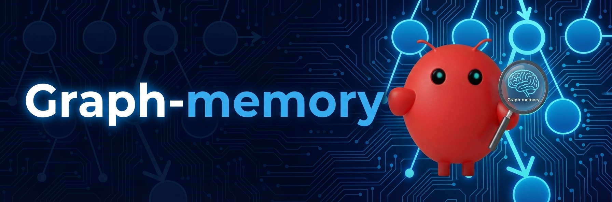
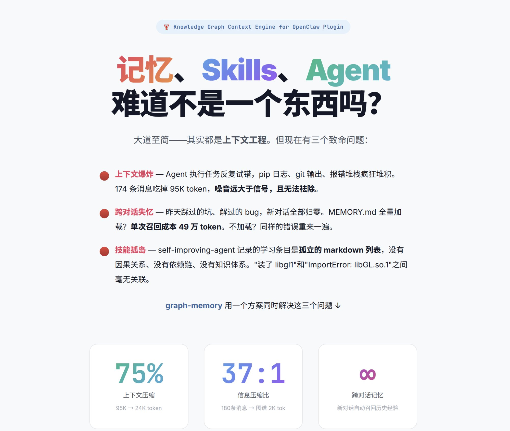
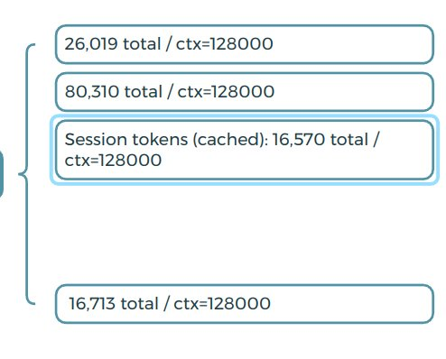

<p align="center">
  
</p>

<h1 align="center">graph-memory</h1>

<p align="center">
  <strong>OpenClaw 知识图谱上下文引擎插件</strong><br>
  作者 <a href="mailto:Wywelljob@gmail.com">adoresever</a> · MIT 许可证
</p>

<p align="center">
  <a href="#安装">安装</a> ·
  <a href="#工作原理">工作原理</a> ·
  <a href="#配置参数">配置</a> ·
  <a href="README.md">English</a>
</p>

---

<p align="center">
  
</p>

## 记忆、Skills、Agent——难道不是一个东西吗？

大道至简——其实都是**上下文工程**。但现在有三个致命问题：

🔴 **上下文爆炸** — Agent 执行任务反复试错，pip 日志、git 输出、报错堆栈疯狂堆积。174 条消息吃掉 95K token，噪音远大于信号，且无法祛除。

🔴 **跨对话失忆** — 昨天踩过的坑、解过的 bug，新对话全部归零。MEMORY.md 全量加载？单次召回成本 49 万 token。不加载？同样的错误来一遍。

🔴 **技能孤岛** — self-improving-agent 记录的学习条目是孤立的 markdown 列表，没有因果关系、没有依赖链、没有知识体系。"装了 libgl1" 和 "ImportError: libGL.so.1" 之间毫无关联。

**graph-memory 用一个方案同时解决这三个问题。**

<p align="center">
  
</p>

> *58 个节点、40 条边、3 个社区——全部从对话中自动提取。右侧面板展示知识图谱的社区聚类（GitHub 操作、B站 MCP、会话管理）。左侧面板展示 Agent 使用 `gm_stats` 和 `gm_search` 工具查询图谱。*

## v2.0 新特性

### 社区感知召回（双路径并行）

召回现在有**两条并行路径**，结果合并去重：

- **精确路径**：向量/FTS5 搜索 → 社区扩展 → 图遍历 → 个性化 PageRank 排序
- **泛化路径**：查询向量 vs 社区摘要 embedding → 匹配社区成员 → 个性化 PageRank 排序

社区摘要在每次社区检测（每 7 轮）后**立即生成**，泛化路径从第一个维护窗口开始就可用。

### 溯源片段（Episodic Context）

PPR 排名前 3 的节点会拉取**原始 user/assistant 对话片段**注入上下文。Agent 不仅看到结构化的三元组，还能看到产生这些知识的实际对话——提高复用过去方案时的准确性。

### 通用 Embedding 兼容

Embedding 模块改用原生 `fetch` 替代 `openai` SDK，开箱即用兼容**所有 OpenAI 兼容端点**：

- OpenAI、Azure OpenAI
- 阿里云 DashScope（`text-embedding-v4`）
- MiniMax（`embo-01`）
- Ollama、llama.cpp、vLLM（本地模型）
- 任何实现了 `POST /embeddings` 的端点

### Windows 一键安装包

v2.0 提供 **Windows 安装包**（`.exe`）。从 [Releases](https://github.com/adoresever/graph-memory/releases) 页面下载：

1. 下载 `graph-memory-installer-win-x64.exe`
2. 运行安装包——自动检测 OpenClaw 安装路径
3. 安装包自动配置 `plugins.slots.contextEngine`、添加插件条目、重启 gateway

## 实测数据

<p align="center">
  
</p>

7 轮对话实测（安装 bilibili-mcp + 登录 + 查询）：

| 轮次 | 无 graph-memory | 有 graph-memory |
|------|----------------|-----------------|
| R1 | 14,957 | 14,957 |
| R4 | 81,632 | 29,175 |
| R7 | **95,187** | **23,977** |

**压缩 75%。** 红色 = 无 graph-memory（线性增长）。蓝色 = 有 graph-memory（图谱替代后收敛）。

<p align="center">
  
</p>

## 工作原理

### 知识图谱

graph-memory 从对话中构建类型化属性图：

- **3 种节点**: `TASK`（做了什么）、`SKILL`（怎么做的）、`EVENT`（出了什么问题）
- **5 种边**: `USED_SKILL`、`SOLVED_BY`、`REQUIRES`、`PATCHES`、`CONFLICTS_WITH`
- **个性化 PageRank**: 根据当前查询动态排序，不是全局固定排名
- **社区检测**: 自动将相关技能分组（Docker 集群、Python 集群等）
- **社区摘要**: LLM 生成每个社区的描述 + embedding，实现语义级社区召回
- **溯源片段**: 链接到图谱节点的原始对话片段，忠实还原上下文
- **向量去重**: 通过余弦相似度合并语义重复的节点

### 双路径召回

```
用户查询
  │
  ├─ 精确路径（实体级）
  │    向量/FTS5 搜索 → 种子节点
  │    → 社区同伴扩展
  │    → 图遍历（N 跳）
  │    → 个性化 PageRank 排序
  │
  ├─ 泛化路径（社区级）
  │    查询 embedding vs 社区摘要 embedding
  │    → 匹配社区的成员节点
  │    → 图遍历（1 跳）
  │    → 个性化 PageRank 排序
  │
  └─ 合并去重 → 最终上下文
```

两条路径并行执行。精确路径结果优先，泛化路径补充精确路径未覆盖的知识域。

### 数据流

```
消息进入 → ingest（零 LLM）
  ├─ 所有消息存入 gm_messages
  └─ turn_index 从数据库最大值续接（重启不归零）

assemble（零 LLM）
  ├─ 图谱节点 → 按社区分组的 XML 注入 systemPrompt
  ├─ PPR 排序决定注入优先级
  ├─ PPR Top 3 节点拉取溯源片段
  ├─ Content 规范化（防止 OpenClaw content.filter 崩溃）
  └─ 保留最后一轮完整对话

afterTurn（后台异步，不阻塞用户对话）
  ├─ LLM 提取三元组 → gm_nodes + gm_edges
  ├─ 每 7 轮：PageRank + 社区检测 + 社区摘要生成
  └─ 用户发新消息时自动中断提取

session_end
  ├─ finalize（LLM）：EVENT → SKILL 升级
  └─ maintenance：去重 → PageRank → 社区检测

下次新对话 → before_prompt_build
  ├─ 双路径召回（精确 + 泛化）
  └─ 个性化 PageRank 排序 → 注入上下文
```

### 个性化 PageRank (PPR)

区别于全局 PageRank，PPR **根据你当前的问题动态排序**：

- 问 "Docker 部署" → Docker 相关 SKILL 分数最高
- 问 "conda 环境" → conda 相关 SKILL 分数最高
- 同一个图谱，完全不同的排名
- 召回时实时计算（几千节点 < 5ms）

## 安装

### 前置条件

- [OpenClaw](https://github.com/openclaw/openclaw)（v2026.3.x+）
- Node.js 22+

### Windows 用户

从 [Releases](https://github.com/adoresever/graph-memory/releases) 下载安装包：

```
graph-memory-installer-win-x64.exe
```

安装包自动完成：插件安装、上下文引擎激活、gateway 重启。运行后直接跳到[第三步：配置 LLM 和 Embedding](#第三步配置-llm-和-embedding)。

### 第一步：安装插件

三种方式任选：

**方式 A — 从 npm 仓库安装**（推荐）：

```bash
pnpm openclaw plugins install graph-memory
```

不需要 `node-gyp`，不需要手动编译。SQLite 驱动（`@photostructure/sqlite`）将预编译二进制打包在 npm tarball 内。

**方式 B — 从 GitHub 安装**：

```bash
pnpm openclaw plugins install github:adoresever/graph-memory
```

**方式 C — 从源码安装**（开发或自定义修改时使用）：

```bash
git clone https://github.com/adoresever/graph-memory.git
cd graph-memory
npm install
npx vitest run   # 验证 80 个测试通过
pnpm openclaw plugins install .
```

### 第二步：激活上下文引擎（关键！）

这是**最容易遗漏的一步**。graph-memory 必须被注册为上下文引擎，否则 OpenClaw 只会用它做召回，**不会触发消息入库和知识提取**。

编辑 `~/.openclaw/openclaw.json`，在 `plugins` 中添加 `slots`：

```json
{
  "plugins": {
    "slots": {
      "contextEngine": "graph-memory"
    },
    "entries": {
      "graph-memory": {
        "enabled": true
      }
    }
  }
}
```

如果没有 `plugins.slots.contextEngine`，插件虽然注册成功，但 `ingest` / `assemble` / `compact` 管线不会启动——你会在日志里看到 `recall`，但数据库里没有任何数据。

### 第三步：配置 LLM 和 Embedding

在 `plugins.entries.graph-memory.config` 中添加 API 密钥：

```json
{
  "plugins": {
    "slots": {
      "contextEngine": "graph-memory"
    },
    "entries": {
      "graph-memory": {
        "enabled": true,
        "config": {
          "llm": {
            "apiKey": "你的LLM-API密钥",
            "baseURL": "https://api.openai.com/v1",
            "model": "gpt-4o-mini"
          },
          "embedding": {
            "apiKey": "你的Embedding-API密钥",
            "baseURL": "https://api.openai.com/v1",
            "model": "text-embedding-3-small",
            "dimensions": 512
          }
        }
      }
    }
  }
}
```

**LLM**（`config.llm`）— 必填。用于知识提取和社区摘要生成。支持任何 OpenAI 兼容端点。建议用便宜/快速的模型。

**Embedding**（`config.embedding`）— 可选但推荐。启用语义向量搜索、社区级召回和向量去重。不配则降级为 FTS5 全文搜索（仍然可用，只是基于关键词匹配）。

> **⚠️ 注意**：`pnpm openclaw plugins install` 可能会重置你的配置。每次重装插件后请检查 `config.llm` 和 `config.embedding` 是否还在。

如果不配 `config.llm`，graph-memory 会回退到环境变量 `ANTHROPIC_API_KEY` + Anthropic API。

### 支持的 Embedding 服务商

| 服务商 | baseURL | 模型 | dimensions |
|--------|---------|------|------------|
| OpenAI | `https://api.openai.com/v1` | `text-embedding-3-small` | 512 |
| 阿里云 DashScope | `https://dashscope.aliyuncs.com/compatible-mode/v1` | `text-embedding-v4` | 1024 |
| MiniMax | `https://api.minimax.chat/v1` | `embo-01` | 1024 |
| Ollama | `http://localhost:11434/v1` | `nomic-embed-text` | 768 |
| llama.cpp | `http://127.0.0.1:8080/v1` | 你的模型名 | 视模型而定 |

模型不支持 `dimensions` 参数时，设为 `0` 或直接不填。

### 重启并验证

```bash
pnpm openclaw gateway --verbose
```

启动日志中应该看到这两行：

```
[graph-memory] ready | db=~/.openclaw/graph-memory.db | provider=... | model=...
[graph-memory] vector search ready
```

如果看到 `FTS5 search mode` 而不是 `vector search ready`，说明 embedding 配置缺失或 API Key 无效。

对话几轮后验证：

```bash
# 检查消息是否入库
sqlite3 ~/.openclaw/graph-memory.db "SELECT COUNT(*) FROM gm_messages;"

# 检查知识三元组是否提取成功
sqlite3 ~/.openclaw/graph-memory.db "SELECT type, name, description FROM gm_nodes LIMIT 10;"

# 检查社区是否被检测和描述
sqlite3 ~/.openclaw/graph-memory.db "SELECT id, summary FROM gm_communities;"

# 在 gateway 日志中确认：
# [graph-memory] extracted N nodes, M edges
# [graph-memory] recalled N nodes, M edges
```

### 常见问题

| 现象 | 原因 | 解决 |
|------|------|------|
| `recall` 正常但 `gm_messages` 为空 | 没设置 `plugins.slots.contextEngine` | 在 `plugins.slots` 中添加 `"contextEngine": "graph-memory"` |
| 显示 `FTS5 search mode` | Embedding 未配置或 API Key 无效 | 检查 `config.embedding` 的密钥和地址 |
| `No LLM available` 错误 | 重装插件后 LLM 配置丢失 | 重新添加 `config.llm` 到 `plugins.entries.graph-memory` |
| `afterTurn` 后没有 `extracted` 日志 | 重启导致 turn_index 重叠 | 升级到 v2.0（修复了 msgSeq 持久化） |
| `content.filter is not a function` | OpenClaw 要求 content 为数组 | 升级到 v2.0（添加了 content 规范化） |
| 对话很多轮但节点为空 | 消息数未达到提取阈值 | 默认需要积累消息。继续对话或调低 `compactTurnCount` |

## Agent 工具

| 工具 | 用途 |
|------|------|
| `gm_search` | 搜索图谱中的相关经验、技能和解决方案 |
| `gm_record` | 手动记录经验到图谱 |
| `gm_stats` | 查看图谱统计：节点数、边数、社区数、PageRank Top 节点 |
| `gm_maintain` | 手动触发图维护：去重 → PageRank → 社区检测 + 摘要生成 |

## 配置参数

所有参数都有默认值，只需设置想要覆盖的。

| 参数 | 默认值 | 说明 |
|------|--------|------|
| `dbPath` | `~/.openclaw/graph-memory.db` | 数据库路径 |
| `compactTurnCount` | `7` | 维护周期（每隔多少轮触发 PageRank + 社区检测 + 摘要） |
| `recallMaxNodes` | `6` | 每次召回最多注入的节点数 |
| `recallMaxDepth` | `2` | 图遍历跳数 |
| `dedupThreshold` | `0.90` | 向量去重的余弦相似度阈值 |
| `pagerankDamping` | `0.85` | PPR 阻尼系数 |
| `pagerankIterations` | `20` | PPR 迭代次数 |

## 数据库

SQLite 通过 `@photostructure/sqlite`（预编译二进制，零编译）。默认路径：`~/.openclaw/graph-memory.db`。

| 表 | 用途 |
|----|------|
| `gm_nodes` | 知识节点（含 pagerank + community_id） |
| `gm_edges` | 类型化关系 |
| `gm_nodes_fts` | FTS5 全文索引 |
| `gm_messages` | 原始对话消息 |
| `gm_signals` | 检测到的信号 |
| `gm_vectors` | Embedding 向量（可选） |
| `gm_communities` | 社区摘要 + embedding |

## 与 lossless-claw 的对比

| | lossless-claw | graph-memory |
|--|---|---|
| **方法** | 摘要 DAG | 知识图谱（三元组） |
| **召回** | FTS grep + 子代理展开 | 双路径：实体 PPR + 社区向量匹配 |
| **跨会话** | 仅当前对话 | 自动跨会话召回 |
| **压缩** | 摘要（有损文本） | 结构化三元组（无损语义） |
| **图算法** | 无 | PageRank、社区检测、向量去重 |
| **上下文溯源** | 无 | 溯源片段（原始对话片段） |

## 开发

```bash
git clone https://github.com/adoresever/graph-memory.git
cd graph-memory
npm install
npm test        # 80 个测试
npx vitest      # 监听模式
```

### 项目结构

```
graph-memory/
├── index.ts                     # 插件入口
├── openclaw.plugin.json         # 插件清单
├── src/
│   ├── types.ts                 # 类型定义
│   ├── store/                   # SQLite CRUD / FTS5 / CTE 遍历 / 社区 CRUD
│   ├── engine/                  # LLM（fetch）+ Embedding（fetch，无 SDK 依赖）
│   ├── extractor/               # 知识提取 prompt
│   ├── recaller/                # 双路径召回（精确 + 泛化 + PPR）
│   ├── format/                  # 上下文组装 + 消息修复 + content 规范化
│   └── graph/                   # PageRank、社区检测 + 摘要、去重、维护
└── test/                        # 80 个 vitest 测试
```

## 许可证

MIT
